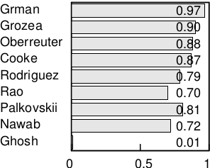
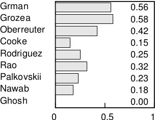
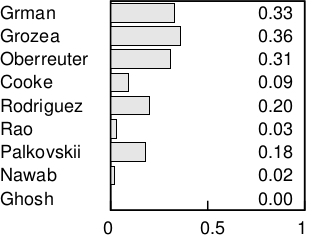

## Paraphrase Text Reuse Detection

#### [Research on Spanish Computing Monolingual Corpora](http://meneses-abad.com/scmc)

###### [Abel Meneses-Abad](http://www.linkedin.com/in/abelma1980) / [@abelma1980](https://twitter.com/abelma1980?lang=es)
###### [Universidad de Camagüey](http://uc.edu.cu) / [Universidad Central Marta Abreu de Las Villas](http://uclv.edu.cu)
________________________

##### Slides to Present in [Ph.D. sessions](http://www.meetup.com/PyThess/), August 30, 2017

##### Thesis directors: [Julio Madera Quintana](http://uc.edu.cu/juliom) / [Alberto Barrón-Cedeño](http://alt.qcri.org/)

##### Collaborator: [Leonel Salazar](http://debianhlg.cubava.cu/)
________________________

###### Get them: [source code](https://github.com/sorice/paraphrase-presentation)

###### Under [Attribution 4.0 International](http://creativecommons.org/licenses/by/4.0/) License.

---

### About Speaker

- 2004 BSc on Telecommunications and Electronics
- 2005-09 Research on FLOSS Development & Deployment
- 2006-12 Developing member of several software projects for high education: SistClon, Infodrez, Shakespeare and Sunshine.
- 2009 Chairman of Free Software Committee, Informatica-Habana 2009
- Member of the Cuban Free Software Users Group
- 2009-13 Dir. of Center for Studies of FLOSS for Culture
- From 2012 PhD candidate on Computing Science in the field of NLP

---

## Plagiarism Detection Roadmap

--

### Basic Problem of Plagiarism

> “The act of taking the writings of another person and passing them off as one’s own, generally in violation of copyright laws.”

- Source code plagiarism has been studied before the '80s. 
##### (Parker1989) Internet upgraded that problem!
- Natural languague texts are the most plagiarised archieves 
##### (85% of Internet available texts).

--

### Basic Problem of Plagiarism

- A third of Turnitin.com papers have significant levels of plagiarism.
##### 40 million papers in accordance with Jon Barrie (founder of Turnitin) 2010 report.
- More copyright violations are among computer science students than in any other academic discipline.
#####(Barrie2010)

--

### Types of Plagiarism

--

### Paraphrase Plagiarism Recognition

#### [An open issue in computer science?]()

---

### Plagiarism have two parts

- Text Reuse Detection
- [Citation Analysis](#/3/1)
### 
#### The objetive of this investigation is [Text Reuse Detection](#/4/1)

--

### Citation Analysis

>“The evaluation of document structure that correspond to citation styles”

---

## Text Reuse Detection

>“the situation in which pre-existing written material is consciously used again during the creation of a new text or version”
####(Clough, 2010)

--

### Types of Text Reuse

```
python setup.py install
```

---

### Pretty Code

```python
for i in range(x):
    print (sqrt(i))
```

---

### 2011 PAN statistics

##### Results of plagiarism methods competition by types

Other types | Autolow | Manual
------|-------
 |  | 

#### Recall in Auto-High paraphrase plagiarism detection is under 0.1.

#### [Paraphrase plagiarism]() detection overall is [less]() than [40%]().