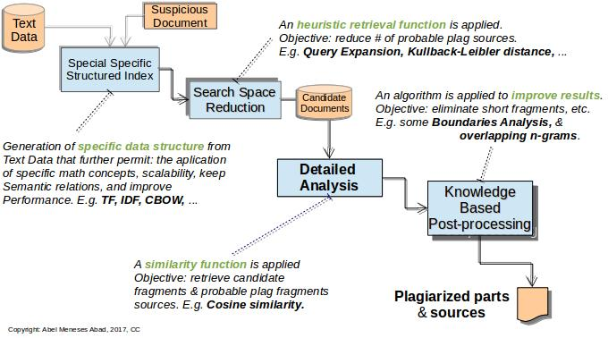

## Paraphrase Text Reuse Detection

#### [Research on Spanish Computing Monolingual Corpora](http://meneses-abad.com/scmc)

###### [Abel Meneses-Abad](http://www.linkedin.com/in/abelma1980) / [@abelma1980](https://twitter.com/abelma1980?lang=es)
###### [Universidad de Camagüey](http://uc.edu.cu) / [Universidad Central Marta Abreu de Las Villas](http://uclv.edu.cu)
________________________

##### Slides to Present in [Ph.D. sessions](http://www.meetup.com/PyThess/), August 30, 2017

##### Thesis directors: [Julio Madera Quintana](http://uc.edu.cu/juliom) / [Alberto Barrón-Cedeño](http://alt.qcri.org/)

##### Collaborator: [Leonel Salazar](http://debianhlg.cubava.cu/)
________________________

###### Get them: [source code](https://github.com/sorice/paraphrase-presentation)

###### Under [Attribution 4.0 International](http://creativecommons.org/licenses/by/4.0/) License.

---

### About Speaker

- 2004 BSc on Telecommunications and Electronics
- 2005-09 Research on FLOSS Development & Deployment
- 2006-12 Developing member of several software projects for high education: SistClon, Infodrez, Shakespeare and Sunshine.
- 2009 Chairman of Free Software Committee, Informatica-Habana 2009
- Member of the Cuban Free Software Users Group
- 2009-13 Dir. of Center for Studies of FLOSS for Culture
- From 2012 PhD candidate on Computing Science in the field of NLP

---

## What is all about?

- The problem of Plagiarism
- Text Reuse Detection (TRD). Paraphrased cases.
- TRD Detailed Analysis Phase. Similarity distances.
  * Preprocessing & Seeding subphase. Preprocess package
  * Match-Merging subphase. Textsim package.
  * Filtering subphase. PAN/P4P corpus experiments.
- Spanish Pipeline, Resources & Software.
  * QtNLP-WordNet application. Spanish Results.
- Spanish Corpus TNLP
- Results in Spanish Text Reuse Detection

---

## Plagiarism Detection Roadmap

--

### Basic Problem of Plagiarism

> “The act of taking the writings of another person and passing them off as one’s own, generally in violation of copyright laws.”

- Source code plagiarism has been studied before the '80s.
##### (Parker1989) Internet upgraded that problem!
- Natural languague texts are the most plagiarised archieves.
##### (85% of Internet available texts).

--

### Basic Problem of Plagiarism (cont)

- A third of Turnitin.com papers have significant levels of plagiarism.
##### 40 million papers in accordance with Jon Barrie (founder of Turnitin) 2010 report.
- More copyright violations are among computer science students than in any other academic discipline.
#####(Barrie2010)

--

### Types of Plagiarism

- Copy & Paste Plagiarism
- [Paraphrase Plagiarism]()
- Cross-Lingual Plagiarism
- Idea Plagiarism
- Self Plagiarism
### 
##### El Thair et al. *Survey of Plagiarism Detection Methods* (2011).
##### Meuschke, N. & Gipp, B. *State-of-the-art in detecting academic plagiarism* (2013).

--

### Paraphrase Plagiarism Recognition

#### [An open issue in computer science?]()

--

### 2011 PAN statistics

##### Results of plagiarism methods competition by types

Other types | Autolow | Manual
------|-------
 |  | 

#### Recall in Auto-High paraphrase plagiarism detection is under 0.1.

#### [Paraphrase plagiarism]() detection overall is [less]() than [40%]().

--

### 2014 PAN statistics

##### (TODO, pending)

--

### Plagiarism Detection Software

#### Main tools that detect plagiarism

- TurnitIn
- WCopyfind
- Sherlock
- SeeSources.com

---

### Plagiarism has two parts

- Text Reuse Detection (click [→]())
- [Citation Analysis](#/4/1) (*click [↓]() for a summary*)
### 
#### This investigation is about [Text Reuse Detection →](#/5/1)

--

### Citation Analysis

>“The bibliometrics research area that deal with the study of citations: the relationship between a part/whole cited doc and a part/whole of the citing doc.”

##### Linda C. Smith (1981). *Citation Analysis*. Report at University of Illinois.
##### Morton V. Malin (1968). *The Science Citation Index: A New Concept in Indexing*. Library Trends 16 (Jan. 1968):376.

---

## Text Reuse Detection

>“the situation in which pre-existing written material is consciously used again during the creation of a new text or version”
#### Measuring text reuse in the news industry (Clough, 2010)

--

### Types of Text Reuse

- Word for word reuse
- [Paraphrasing]()
- Translated re-use
- Re-use of ideas
- Re-use of source code

### 
###### On the Mono- and Cross-Language Detection of Text Re-Use and Plagiarism (Barrón-Cedeño, 2012).

### 
#### This investigation is about [Paraphrase Text Reuse Detection →](#/6/1)
#### [Text Reuse Detection Flow](#/5/2) (*click [↓]()*)

--

### Text Reuse Detection Flow
##### Strategies for retrieving plagiarized documents (Stein, 2007)

--



--

### Corpus of Text Reuse

#### Also called Plagiarism Corpus

- PAN-PC
- P4P
- Wikipedia Plagiarism Short Answers
- METER

--

### Research Groups

- 

---

### Paraphrased Text Reuse Detection

>“Paraphrase: those language expressions different in form but expressing (approximately) the same meaning”

##### *Relational paraphrase acquisition from Wikipedia: The WRPA method and corpus*. Vila (2013)

--

### Paraphrase Text Alignment Approaches

#### Best algorithms for Paraphrased Text Reuse has three parts in the Text Alignment subprocess.
- [Seeding](#/6/2)
- [Extension](#/6/3)
- [Filtering](#/6/4)
### 

#### This investigation proposes notes in: [Text Alignment Subprocess →](#/6/1)
### 
##### The phase "Detailed Analysis" was redefined in 2013 as "Text Alignment".
###### Overview of the 5th International Competition on Plagiarism Detection (Potthast, 2013)
#### more about [Paraphrase](#/6/3) (*click [↓](#/6/3)*)

--
### Paraphrase Complexity

#### Paraphrase phenomenon has been described. Here are some examples of typologies.

- **Morphology - based changes**: Inflections, modal verb & derivational changes.
- **Lexicon - based changes**: Spelling, same polarity, synthetic & analitic sustitutions.
- **Syntax - based changes**: Negation, ellipsis, etc.
- **Discourse - based changes**: Punctuation & format changes, styles alternation, etc.
- **Miscellaneous - based changes**: Discourse structures & order changes. Addition & deletion.
- **Semantic - based changes**: Imply a different lexicalisation of the same content unit.

---

## Text Alignment in Text Reuse Detection

---

### Pretty Code

```python
for i in range(x):
    print (sqrt(i))
while (i > 0):
    if A == B:
        return True
```